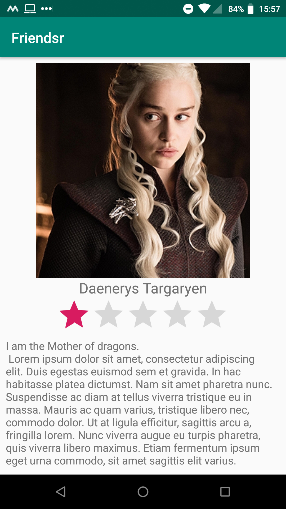

# friendsr

Friendsr is a social app that enables you to view your friends' picture and some information about them, and rate them.

The main screen shows a grid of all your friends and their names. Here you can tap one of them to go to their profile.

On a friend's profile, you can view their main picture and read their biography. You can also rate them. The rating is stored on your device so you will never forget what you think about your friends.

The gallery of profiles.

A rated profile. If the bio is too long, you can just scroll down to read it all.

A rated profile in landscape mode. In this mode, you can scroll through the bio while the picture stays fixed.

